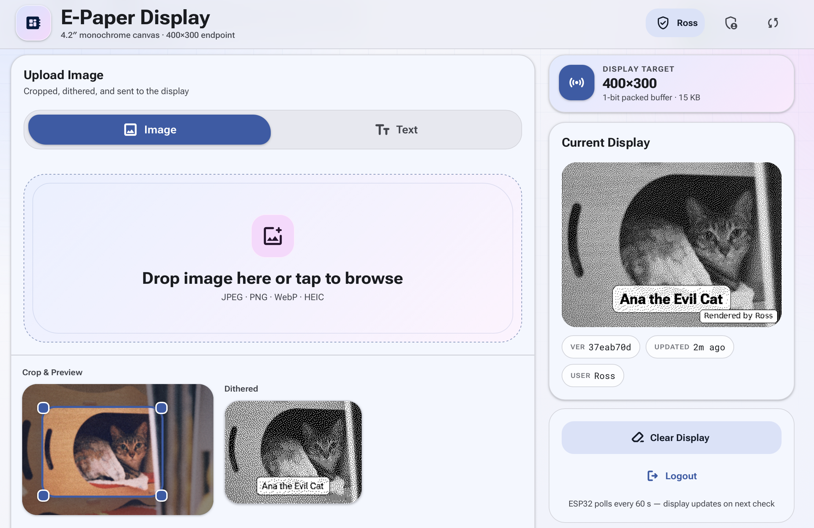
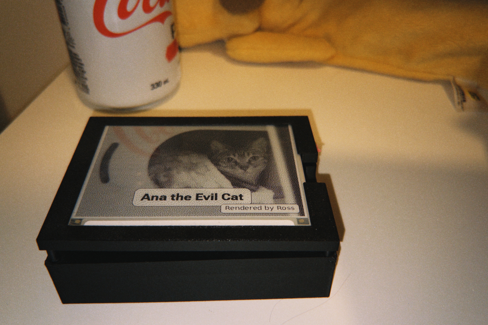

# FAP
Fresh a Paper (FAP) is a software based solution that devoted to provide synchronization between local/remote e-paper display and content rendering server.

<p align="center">
	
	
</p>

## Hardware Requirements (Compatable Hardware)
- [E-Paper ESP32 Driver Board](https://www.waveshare.com/wiki/E-Paper_ESP32_Driver_Board?srsltid=AfmBOoqpCtNCmiVf-b9Cmp73QpE3um6N21NR4lbn6t7mNJLZl_bly2N8)
- [4.2inch e-Paper](https://www.waveshare.com/4.2inch-e-paper-module.htm?srsltid=AfmBOop5Bltp6olyuTlaRhYOxGR9V-9Mfk0HWNq-2zFP1WtwJECL9udw)

## Quick Start
1. Clone the directory
```
git clone https://github.com/AnaOnTram/FAP
cd FAP
```
2. Prepare the server
```
cd server
sudo bash deploy.sh
```
3. Amending the `config.h` correspondingly and Burn the script to the esp32 (`EPaper_Remote_Client/EPaper_Remote_Client.ino`) using Arduino IDE.

## Update
To update the solution
```
git pull
sudo bash server/deploy.sh
```

### Under Development
- [x] ESP32 Deep Sleep Implementation (Not verified yet)
- [ ] Multi-language support